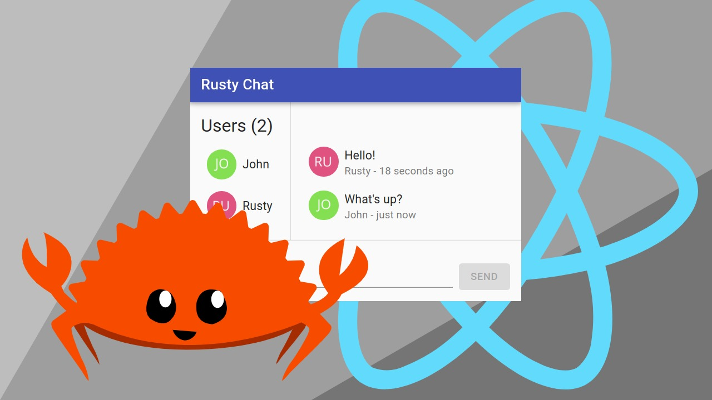

# Rusty Chat

<p align="center">
  
</p>

A chat app made with Rust and React.

Source code for article [Building a Real-time Chat App in Rust and React](https://outcrawl.com/rust-react-realtime-chat).

## Set up

First start the server.

```bash
RUST_LOG=info cargo run
```

Then start the front-end app.

```bash
cd frontend && nvm use && npm install
npm run start
```

Now you can open <http://localhost:3000/> in multiple tabs and try it out.
